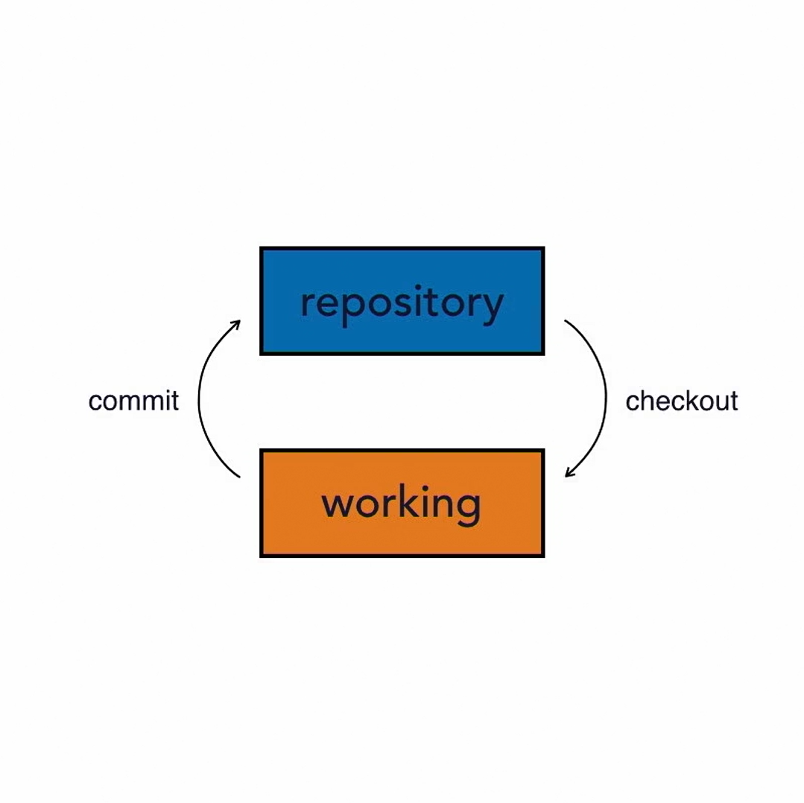
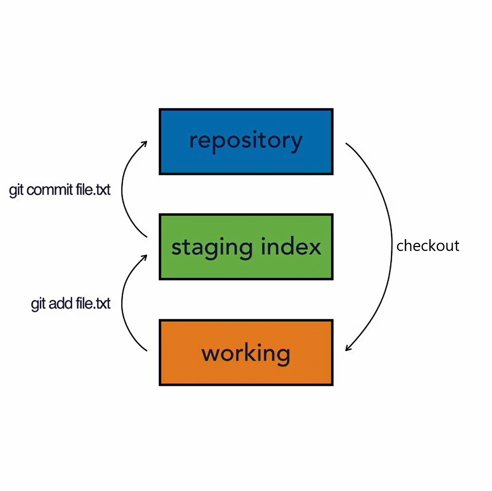

# Git Essentials

### Git is a Version Control System(VCS), aka Source Code Management(SCM).

## History of VCS Tools:

1. Source Code Control System(SCCS):
    - 1972
    - closed-source
    - only Unix support
    - supported text files
    - stored original version file and sets of changes
    - one user could work on a file at a time (local repository)
2. Revision Control System(RCS):
    - 1982
    - open-source
    - cross-platform
    - supported text files
    - stored latest version file and sets of changes
    - one user could work on a file at a time (local repository)
3. Concurrent Versions System(RCS):
    - 1986-1990
    - open-source
    - cross-platform
    - supported text files
    - stored all versions of the files
    - multi-user repositories (remote repositories)
4. Apache Subversion(SVN):
    - 2000
    - open-source
    - cross-platform
    - supported text and image files
    - directory based tracking
    - multi-user repositories (remote repositories)
5. Bitkeeper SCM:
    - 2000
    - similar to SVN
    - closed-source, proprietary
    - distributed version control
    - community version was free
    - used for source code of Linux kernel from 2002 to 2005
    - controversial to use proprietary SCM for open-source project
    - April 2005: the community version was not free anymore
6. Git:
    - April 2005
    - created by Linus Torvalds(also created Linux)
    - replacement for Bitkeeper for Linux source code management
    - distributed version control
    - open-source and free software
    - faster than other SCMs
    - better safeguards against data corruption

 

## Github:
- 2008
- hosts Git repositories
- purchased by Microsoft in 2018

 

## Distributed Version Control:
- different users maintain their own repositories
- no single central or master repository
- changes are stored as change sets
- tracks changes and not versions unlike CVS and SVN
- change sets can be exchanged between repositories ("merge-in change sets" or "apply patches")

### Advantages of Distributed Version Control:
- no need to communicate with a central server
- faster than other traditional version control systems
- no network access required
- no single failure point
- encourages participation and forking of projects
- developers can work independently
- submit change sets for inclusion or rejection

 

## Architecture:

- Git uses **Three Tree Architecture** as opposed to other VCSs that use traditional **Three Tree Architecture**

Two Tree Architecture - Traditional        |  Three Tree Architecture - Git
:-----------------------------------------:|:-----------------------------------------:
      |  

 

## Git Workflow:

- Make changes
- Stage changes
- Commit changes

 

    <image src="images/git-workflow.gif">

    <b>Sample Workflow - </b>Involving three changes A, B, C

 

## Git Configuration:

1. System Config File-
    - Scope&nbsp;&nbsp;&nbsp;&nbsp;&nbsp;&nbsp;:&nbsp;`git config --system`
    - Win Path&nbsp;:&nbsp;`Program Files\Git\etc\gitconfig`
    - Mac Path&nbsp;:&nbsp;`etc\gitconfig`

2. User Config File-
    - Scope&nbsp;&nbsp;&nbsp;&nbsp;&nbsp;&nbsp;:&nbsp;`git config --global`
    - Win Path&nbsp;:&nbsp;`Users\<user_name>\.gitconfig`
    - Mac Path&nbsp;:&nbsp;`$Home\.gitconfig`

3. Project Config File-
    - Scope&nbsp;&nbsp;&nbsp;&nbsp;&nbsp;:&nbsp;`git config`
    - Path&nbsp;&nbsp;&nbsp;&nbsp;&nbsp;&nbsp;&nbsp;&nbsp;:&nbsp;`my_project\.git\config`

 

## Commonly Used Commands:

- Set configuration:
    
        git config --global <config_name> <value>

        git config --global user.name "Ashutosh Ojha"

        git config --global user.email "ashutosh.ojha2009@gmail.com"

        git config --global core.editor "atom --wait"
    
        git config --global color.ui true

 

- Show configuration:
    
        // lists all config properties
        git config --list

        // shows a specific configuration property
        git config <config_property>

        // shows a user name
        git config user.name

 

- Show command manual:
    
        git help <command_name>

        man git-<command_name>

 

- Initialize repository:
    
        // adds .git to directory
        // converts a normal directory into a repository
        git init 

 

- Get repository status:
    
        // gives status info like edited, staged, unstaged and untracked files
        git status

 

- Stage changes:
    
        git add <change_path>

        // stages all changed files in the directory
        git add .

        // stages a specific change
        git add changed_file.txt 

        // stages multiple files
        git add changed_file_1.txt changed_file_2.txt

 

- Unstage changes:
    
        git reset <change_path>

        // unstages all changed files in the directory
        git reset .

        // unstages a specific change
        git reset changed_file.txt 

        // unstages multiple files
        git reset changed_file_1.txt changed_file_2.txt

 

- Commit changes:

        // makes the staged changes permanent and tracks them
        git commit

        // commit with a message
        git commit -m "<message>"

        // commit with a message and additional descriptions
        git commit -m "<message>" "<desc1>" "<desc2>"

 

- Stage and Commit shortcut:

        // directly commits all the changes(no manual staging needed)
        // commits all changes(staged and unstaged) except untracked changes
        git commit -a
        git commit --all

        // commits all changes with a message
        git commit -am "<message>"

 

- View commit log:

        // lists all the commits
        git log

        // limits the number of commits to be shown
        git log -n <limit>

        // filter by date
        git log --since=<date1> --until=<date2>
    
        // filter by author name
        git log --author="<author_name>"

        // filter by commit message
        git log --grep="<commit_message>"

 

- Show specific commit:

        // shows all the changes(git diff) done in a particular commit
        // need not type entire 40 character commit id, first few characters also work
        git show <commit_id>

 

- View changes in files/commits:
    
        // shows difference between old and new version of each file

        // lists differences in all modified files
        // compares working directory version against staging tree version of the files
        git diff

        // use --color-words to show and color the differences word by word
        git diff --color-words

        // shows difference in a specific modified file
        git diff changed_file.txt 

        // shows difference in multiple modified files
        git reset changed_file_1.txt changed_file_2.txt

        // compares staging tree version against repository version of the files (staged/cached)
        git diff --staged
        git diff --cached

        // view differences between commits
        // HEAD can be used instead of the commit id to point to the latest commit 
        git diff <commit_1_id>..<commit_2_id>

        // hit 'q' to exit out of diff view

 

- Delete files:

        // stages deleted file if manually deleted
        git rm <deleted_file>
        
        // permanently deletes and stages a file
        git rm <to_be_deleted_file>

 

- Moving or Renaming files:

        // manually moving or renaming a file is identified as deleting old file and adding new file
        // upon staging it is recognized as rename operation
        // moving a file using command line is identified as renaming and is automatically staged

        // renaming file name
        git mv <old_file_name> <new_file_name>

        // moving a file
        git mv <old_file_name> <new_path/old_file_name>